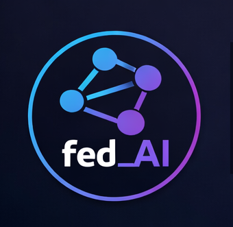

# fed_AI

fed_AI is a Nostr-centric, decentralized, federated, pay-as-you-go AI inference network that routes requests across independent nodes. It focuses on low latency, competitive pricing, pluggable models, and privacy-preserving operation without centralized control.

Core intent
- Separate decision-making from computation: a stable control plane coordinates routing, pricing, trust, and metering, while external runners execute models.
- Build a federated market where operators supply capacity and users pay only for what they consume.
- Enforce trust and verification cryptographically with signed envelopes and metering records.
- Support Nostr-compatible identity and peer-to-peer Lightning payments for settlement.

# fed_AI – FAQ

## What is fed_AI?

fed_AI is an experimental, decentralised AI infrastructure project.
It breaks AI systems into composable services run by independent operators and connected through routing logic rather than a single provider.
fed_AI is model-agnostic and is designed to support text, image, audio, and video workloads through composable services, even if not all are implemented initially.

The focus is resilience, cost control, locality, and operator choice.

---

## Is fed_AI a blockchain or crypto project?

No.

fed_AI does not require a blockchain, token, or on-chain execution to function.
Lightning payments are first-class and strictly peer-to-peer, but the core architecture remains off-chain and protocol-driven.

---

## Are payments peer-to-peer?

Yes. All payments in fed_AI are peer-to-peer over Lightning.

Payments flow directly:

- from client to node
- and optionally client to router for routing fees

There is no pooled balance, clearing house, or intermediary wallet.

---

## Do routers hold or relay funds?

No.

Routers never custody funds, even temporarily.

Routers:

- do not receive client funds on behalf of nodes
- do not forward payments
- do not maintain balances
- do not act as escrow agents

Routers should be treated as payment-orchestration aware, not payment participants.

---

## What role do routers play in payments?

Routers coordinate payment requirements, not payment flows.

They may:

- advertise required pricing for nodes
- advertise their own routing fee
- specify payment timing rules (before-work or after-work)
- verify that required payments have occurred
- refuse to route work if payment conditions are not met

They do not touch funds.

---

## How does a typical peer-to-peer Lightning flow work?

Example flow:

1. Client submits a request with cost constraints
2. Router selects candidate nodes and returns:

   - node Lightning invoice requests or invoice endpoints
   - router fee invoice request if applicable
3. Client pays:

   - node(s) directly via Lightning
   - router directly via Lightning (if a routing fee applies)
4. Client provides payment proof (eg invoice preimage or verification reference)
5. Router verifies payment proofs
6. Work is executed

At no point does the router intermediate the payment itself.

---

## Can payment be pay-before-work or pay-after-work?

Yes, but still peer-to-peer.

Supported patterns:

- Pay-before-work
  Client pays node invoice first, then submits proof to router.
- Pay-after-work
  Node issues invoice after successful completion, client pays directly.

Routers only verify that the correct payment occurred under the agreed terms.

---

## How are partial failures handled?

Failure handling is explicit and protocol-driven.

Examples:

- If a node fails before completion, no invoice is issued or payment is required.
- If partial work is allowed, partial invoices may be issued directly by nodes.
- Routers never refund funds, because they never received them.

Dispute resolution is limited by design and favours determinism over subjectivity.

---

## How does this interact with staking?

Staking remains a bond, not a payment rail.

If Lightning-backed staking is used later:

- funds are locked peer-to-peer
- time-bound and revocable by protocol rules
- never pooled or rehypothecated

Again, routers do not custody stake.

---

## Why enforce strict P2P payments?

This design:

- removes custodial risk
- avoids regulatory complexity
- reduces attack surface
- prevents routers becoming banks
- keeps incentives aligned and visible

It also fits Lightning’s strengths naturally.

---

## What problem is fed_AI trying to solve?

Large AI systems today are:

- opaque
- centralised
- difficult to audit
- expensive at scale
- all-or-nothing in trust

fed_AI replaces this with:

- small, specialised services
- explicit capabilities
- observable behaviour
- replaceable components
- pay-as-you-go routing

---

## What are “nodes” in fed_AI?

Nodes are specialised service providers.

A node might:

- generate embeddings
- sanitise or chunk input
- enforce policy
- cache results
- perform small-model inference
- handle post-processing

Nodes are intentionally narrow in scope.

---

## Can low-spec hardware participate?

Yes. Low-spec hardware is a first-class participant.

Many node roles are CPU-only, memory-light, or I/O-bound, including:

- pre/post processing
- policy enforcement
- caching
- small embedding models
- registry and health helpers

You do not need a GPU to contribute meaningfully.

---

## What are routers?

Routers are control-plane infrastructure.

They:

- accept client requests
- select appropriate nodes
- enforce policy and limits
- track performance
- manage routing weights

Routers do not perform inference by default.

---

## Can anyone run a router?

Not automatically.

Router setup includes:

- mandatory hardware checks
- mandatory benchmarks
- strict minimum requirements
- probation mode by default

Routers are deliberately harder to run than nodes to protect the network.

---

## How does fed_AI decide what a machine can do?

Through a built-in capability profiler.

On first run, the software:

- inspects hardware and OS
- optionally runs short benchmarks
- classifies the machine into capability bands
- recommends safe setup types

No roles are inferred silently.

---

## What is a capability manifest?

A capability manifest is a signed declaration of:

- enabled roles
- limits and defaults
- benchmark results if available
- software version

Routers use this for initial routing decisions, then rely on observed behaviour over time.

---

## Does fed_AI collect hardware fingerprints?

No, not by default.

The profiler:

- avoids serial numbers and unique identifiers
- uses coarse capability bands instead of raw specs
- requires explicit opt-in for verbose reporting

Privacy is a design constraint.

---

## Does fed_AI support image generation?

Yes, in principle.

Image generation fits naturally into fed_AI’s model because it can be decomposed into specialised services, for example:

- prompt normalisation and safety filtering
- image generation nodes (diffusion or other models)
- upscaling or refinement nodes
- format conversion and optimisation
- metadata and provenance tagging

These can run as separate nodes, potentially on different hardware, rather than a single monolithic service.

---

## Does fed_AI support video generation?

Potentially, yes, but with important constraints.

Video workloads are heavier and are expected to be handled as multi-stage pipelines, such as:

- script or storyboard generation
- keyframe or scene generation
- frame interpolation
- video assembly and encoding
- post-processing and compression

Not all nodes would handle full video generation. Many roles are CPU or I/O bound and suitable for modest hardware.

---

## Do I need a GPU to use fed_AI for images or video?

Not necessarily.

- Some nodes require GPUs, especially image or video generation models.
- Many supporting roles do not, including:

  - prompt preparation
  - safety and policy checks
  - frame selection and scoring
  - upscaling orchestration
  - encoding and packaging

fed_AI is designed so GPU-heavy nodes are optional and replaceable, not mandatory for participation.

---

## Is fed_AI trying to compete with dedicated image or video platforms?

No.

fed_AI does not aim to be a single “image generator” or “video app”.

Instead, it provides:

- infrastructure for composing creative pipelines
- routing across different providers and models
- transparency about where work is done
- flexibility to mix local, open, and proprietary services

Dedicated platforms can exist on top of fed_AI rather than being replaced by it.

---

## Are image and video features production-ready?

No.

Image and video creation are considered future-facing workloads:

- supported by the architecture
- not guaranteed in early releases
- dependent on available nodes and operators

Early focus remains on correctness, routing, profiling, and trust mechanics.

---

## Why mention image and video at all, then?

Because the architecture is intentionally model-agnostic.

If fed_AI only worked for text, it would be a partial solution.
Designing for image and video from the start avoids architectural dead ends later.

---

## What types of clients can use fed_AI?

fed_AI is client-agnostic. Any system that can speak the protocol and respect routing contracts can be a client.

Typical client types include:

### Application developers

- Web apps
- Mobile apps
- Desktop software
- Games and interactive tools

They use fed_AI to:

- call AI services on demand
- avoid vendor lock-in
- choose locality or cost profiles
- mix proprietary and open models

---

### Backend services and APIs

- SaaS platforms
- Internal microservices
- Data processing pipelines
- Automation systems

fed_AI acts as:

- an AI service mesh
- a routing layer for AI workloads
- a cost-controlled inference backend

---

### Privacy-sensitive clients

- Self-hosted applications
- Research tools
- Regulated environments
- On-device or edge systems

These clients may:

- restrict which nodes can be used
- prefer local or trusted operators
- avoid centralised providers entirely

---

### AI tooling and orchestration systems

- Agent frameworks
- Prompt orchestration engines
- Workflow automation tools
- Evaluation and testing harnesses

fed_AI provides:

- specialised nodes for each stage
- observable execution paths
- replaceable components

---

### Batch and offline workloads

- Document processing
- Dataset labelling
- Index building
- Embedding generation
- Periodic analysis jobs

These clients benefit from:

- lower-cost routing
- non-realtime execution
- opportunistic capacity

---

### Other AI networks and brokers

fed_AI can itself be a downstream or upstream system.

Examples:

- routing to proprietary models when needed
- acting as a pre/post-processing layer
- aggregating smaller providers behind a single interface

---

### Clients with stake (optional)

In later phases, some clients may:

- stake to reserve capacity
- guarantee throughput
- reduce throttling during congestion

Client staking is optional and never required to use the system.

---

## What is “staking” in fed_AI?

Staking is a bond against bad behaviour, not an investment.

It exists to:

- discourage abuse
- smooth routing decisions
- bound blast radius
- protect routers from cheap attacks

It is not yield, governance, or speculation.

---

## Is staking mandatory?

- Nodes: No. Zero-stake nodes are allowed.
- Routers: Yes, to exit probation and operate normally.
- Clients: Optional, future-facing only.

Stake increases priority and trust weighting, not access rights.

---

## Can stake override poor performance?

No.

Performance, reliability, and uptime always dominate routing decisions.
Stake is capped and cannot rescue a bad node or router.

---

## What can cause stake to be slashed?

Only objective, provable failures, such as:

- cryptographic misrepresentation
- repeated job acceptance with failure
- output tampering
- explicit policy violations
- refusing accepted jobs

Stake is never slashed for quality or subjective outcomes.

---

## Does stake expire?

Yes.

All stake:

- decays
- expires
- or is consumed by use

This prevents permanent dominance and idle capital.

---

## Is there a fed_AI token?

Not currently.

Early versions use abstract stake units.
The design allows later mapping to real assets without redesign.

---

## How does fed_AI compare to proprietary AI providers?

fed_AI does not try to replace them outright.

Instead it offers:

- composability
- auditability
- locality
- operator choice
- resilience to single-provider failure

They can coexist in the same workflows.

---

## Is this production-ready?

No.

fed_AI is experimental.
Expect rough edges, iteration, and changing assumptions.

---

## Who is this for?

fed_AI is for people interested in:

- decentralised systems
- AI infrastructure
- transparent compute
- running useful services on ordinary hardware
- protocol-first design

---

## What’s next?

Immediate focus:

- proof-of-concept implementations
- capability profiling
- routing and staking mechanics
- documentation and threat modelling

Everything else builds on that foundation.
