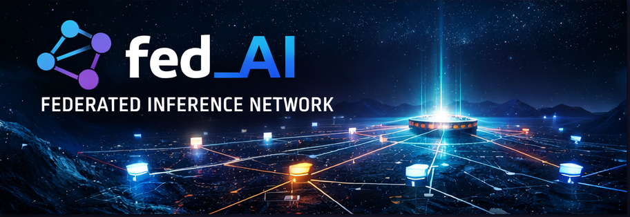

# fed_AI Overview

fed_AI is a Nostr-centric, decentralized, federated, pay-as-you-go AI inference network.

- Requests route across independently operated nodes.
- Nodes advertise capabilities, pricing, and capacity.
- A router selects nodes based on latency, cost, availability, and trust.
- The system prioritizes low latency, competitive pricing, privacy, decentralization, and modularity.
- Control plane stability enables compute plane freedom.

Core problem it solves
- Centralized inference ecosystems are opaque, hard to extend, and economically asymmetric.
- fed_AI reframes inference as a federated market with verifiable trust and metering.

What it is not
- Not a single hosted AI service.
- Not a blockchain or consensus system.
- Not a replacement for model training.
- Not a trust-based marketplace.
- No centralized inference provider. No vendor lock-in.

Nostr alignment
- Node identities use Nostr-compatible Ed25519 keys.
- Signed envelopes align with Nostr signing primitives.
- Discovery and trust can be relay-backed without exposing prompts or outputs.
- Nostr relays are for discovery and trust; inference operations are peer-to-peer between client, router, and node.

Payments
- Settlement is peer-to-peer over Lightning from day one; routers coordinate requirements but never custody funds.

Control plane
- Routing, scheduling, metering, trust, protocol enforcement.

Compute plane
- Model execution via external runners.

Design principle
- Control plane stability enables compute plane freedom.
